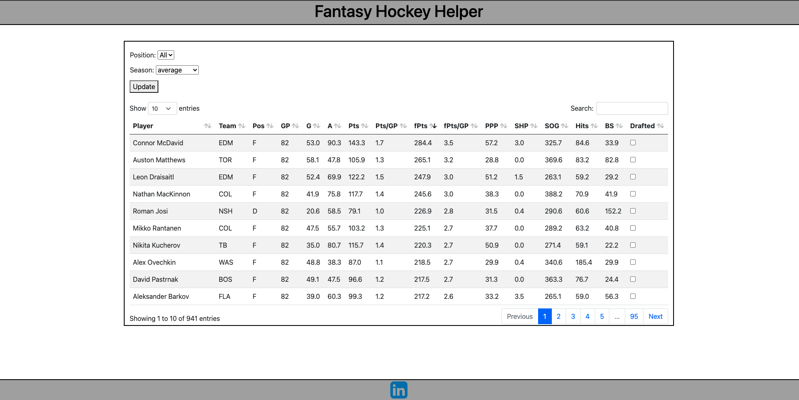
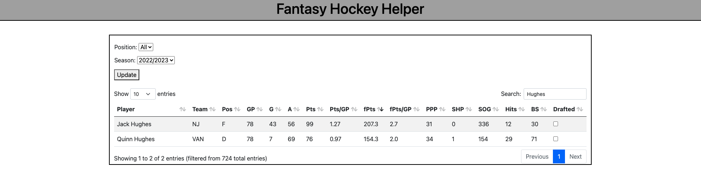

# Fantasy Hockey Helper

## Description
A web application created to help the user draft their fantasy hockey team by highlighting all player statistics in the last 3 seasons as well as aggregating them.

## Built using
* Python
* Flask
* HTML/CSS
* SQLite

## Instructions
* Clone the repository: `https://github.com/matt-ham/Fantasy_Hockey_Helper.git`
* Set up database:
  - Run `database.py` to intitialize the database
  - Run `clean.py` to populate it
* Run the application: Run `app.py`
* Open your web browser and navigate to `http://localhost:5000`

## Features
* Filter players by:
  - Positions
  - Year
* Sort by any statistic
* Ability to search by:
  - Player name
  - Team
* Calculate 82-game average for every player over a 3 season time frame
* Uses ESPN fantasy scoring system, denoted `fpts`

## Webpage Example

*Table with 3-year player averages*

*Table after using the player search on the 2022/2023 season*
